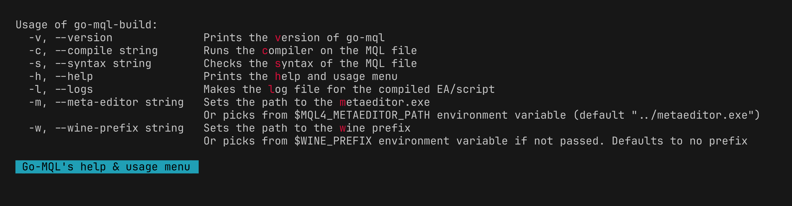
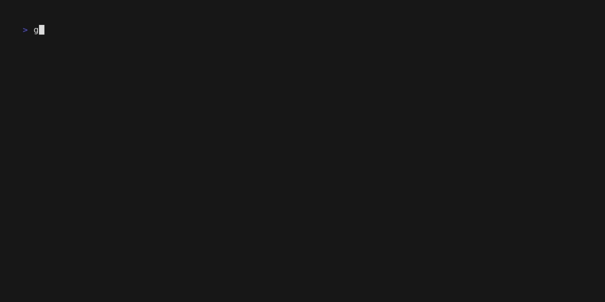
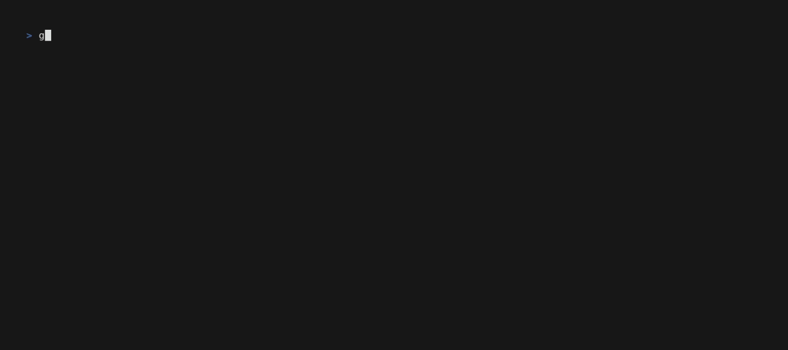

# MQL4 Build Tool

A simple MQL4 build tool written in Go for Linux (through wine) and Windows. It
will compile the MQL4 EA/script and output the diagnostics to the terminal.

## Installation

You can download the binary from the
[Releases](https://github.com/MAK227/go-mql-build/releases) page.

Or install it with

```bash
go install github.com/MAK227/go-mql-build@latest
```

## Building from source

1. Install Go
2. Clone the repository
3. Run `go build`

> [!TIP]
> Symlink the binary to a directory in your `$PATH` to make it easier to use.

## Usage



> [!NOTE]
> The binary is named `go-mql-build` and should be ran from the `MQL4`
> directory. Files should not have spaces in their names.

The tool will compile the MQL4 EA/script and output the diagnostics to the
terminal. Will also create a `.log` file with the same name as the EA/script.

> [!WARNING]
> The MT4 should be ran in portable mode to have the `metaeditor.exe` and
> `MQL4` folder in the same directory if it's not installed in the same
> directory.

## Example

For compilation:

```bash
go-mql-build -c /path/to/your/script.mq4
```

For syntax check:

```bash
go-mql-build -s /path/to/your/script.mq4
```

## Usage Gif

For successful compilation:



For failed compilation:


