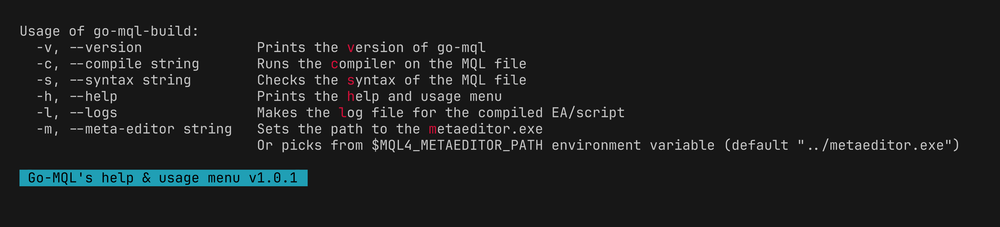
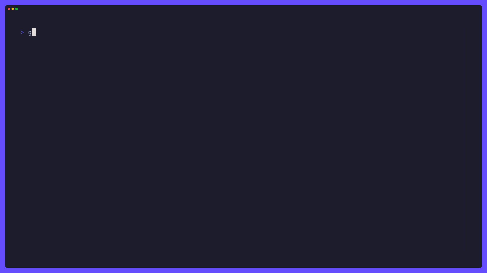
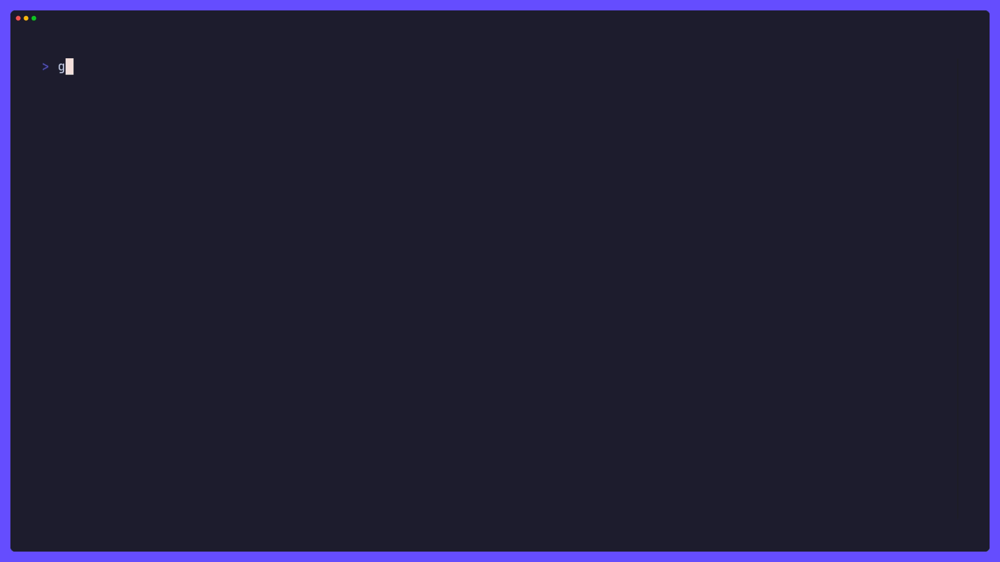
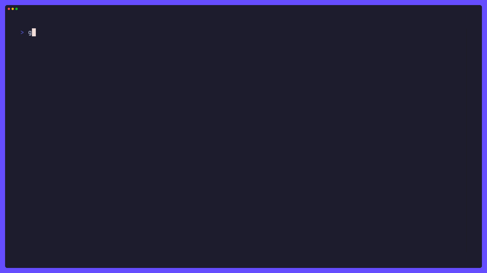

# MQL4 Build Tool

<!--toc:start-->

- [MQL4 Build Tool](#mql4-build-tool)
  - [Installation](#installation)
  - [Building from source](#building-from-source)
  - [How it works](#how-it-works)
  - [TUI](#tui)
  - [Example](#example)
  - [Usage](#usage)
  - [Contribution 🤝](#contribution-🤝)
  - [Star History](#star-history)
  <!--toc:end-->

A simple MQL4 build tool written in Go for Linux (through wine) and Windows. It
will compile the MQL4 EA/script and output the diagnostics to the terminal.

## Installation

You can download the binary from the
[Releases](https://github.com/MAK227/go-mql-build/releases) page.

Or install it with

```bash
go install github.com/MAK227/go-mql-build@latest
```

## Building from source

1. Install Go
2. Clone the repository
3. Run `go build`

> [!TIP]
> Symlink the binary to a directory in your `$PATH` to make it easier to use.

## How it works



> [!NOTE]
> The binary is named `go-mql-build` and should be ran from the `MQL4`
> directory. Files should not have spaces in their names.

The tool will compile the MQL4 EA/script and output the diagnostics to the
terminal. Will also create a `.log` file with the same name as the EA/script.

> [!WARNING]
> The MT4 should be ran in portable mode to have the `metaeditor.exe` and
> `MQL4` folder in the same directory if it's not installed in the same
> directory.

## TUI

Running the tool without any arguments will open a TUI with the file picker and preview.



### Keybindings

|    Key     | Description              |
| :--------: | ------------------------ |
|    `↑`     | Select the previous file |
|    `↓`     | Select the next file     |
| `ctrl+c/q` | Exit program             |
|  `ctrl+u`  | Jump 5 files up          |
|  `ctrl+d`  | Jump 5 files down        |
| `shift+u`  | Jump to first file       |
| `shift+d`  | Jump to last file        |
|  `enter`   | Compile target           |
|    `s`     | Syntax check             |

## Example

For compilation:

```bash
go-mql-build -c /path/to/your/script.mq4
```

For syntax check:

```bash
go-mql-build -s /path/to/your/script.mq4
```

## Usage

For successful compilation:



For failed compilation:



## Contribution 🤝

Contributions are welcome! Whether you want to add new features,
fix bugs, or improve documentation, feel free to open a pull request.

## Star History

<!-- [](https://star-history.com/#MAK227/go-mql-build&Date) -->

<a href="https://star-history.com/#MAK227/go-mql-build&Date">
 <picture>
   <source media="(prefers-color-scheme: dark)" srcset="https://api.star-history.com/svg?repos=MAK227/go-mql-build&type=Date&theme=dark" />
   <source media="(prefers-color-scheme: light)" srcset="https://api.star-history.com/svg?repos=MAK227/go-mql-build&type=Date" />
   
 </picture>
</a>

<p style="display:flex;flex-wrap:wrap;">           </p>
